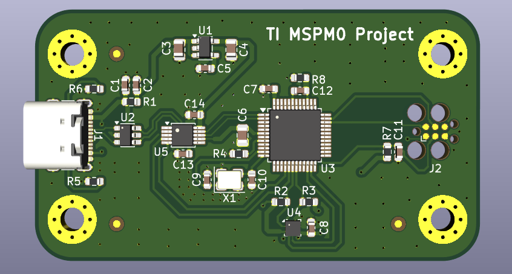
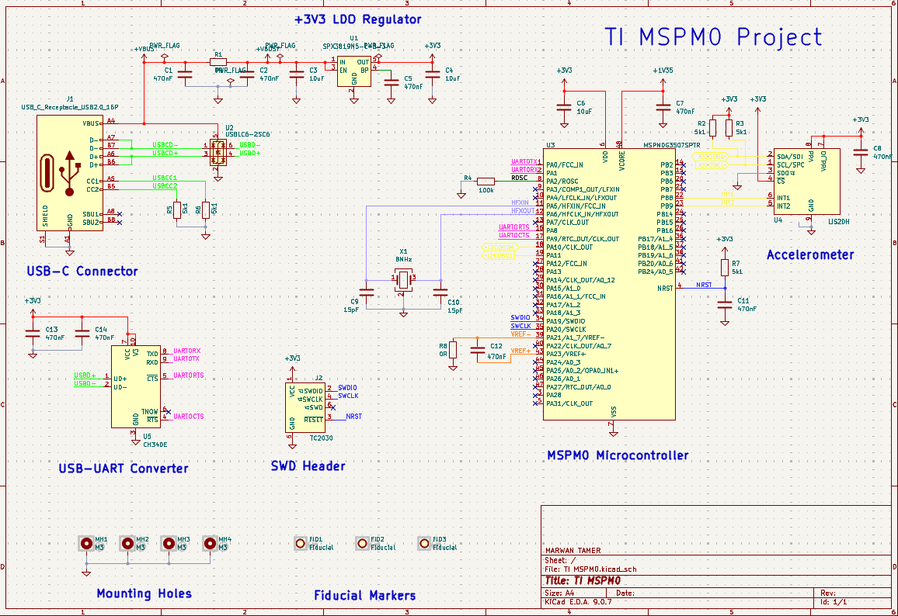
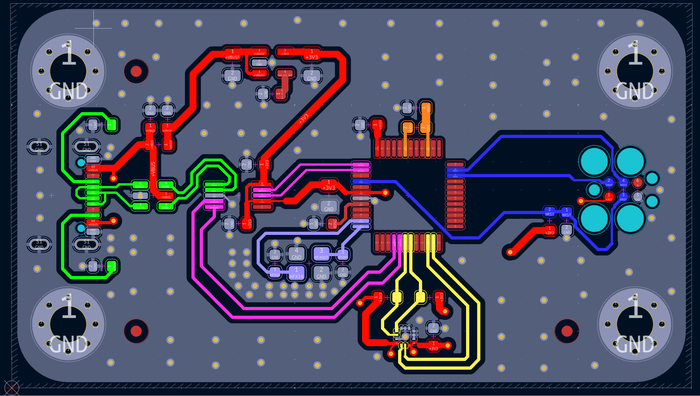
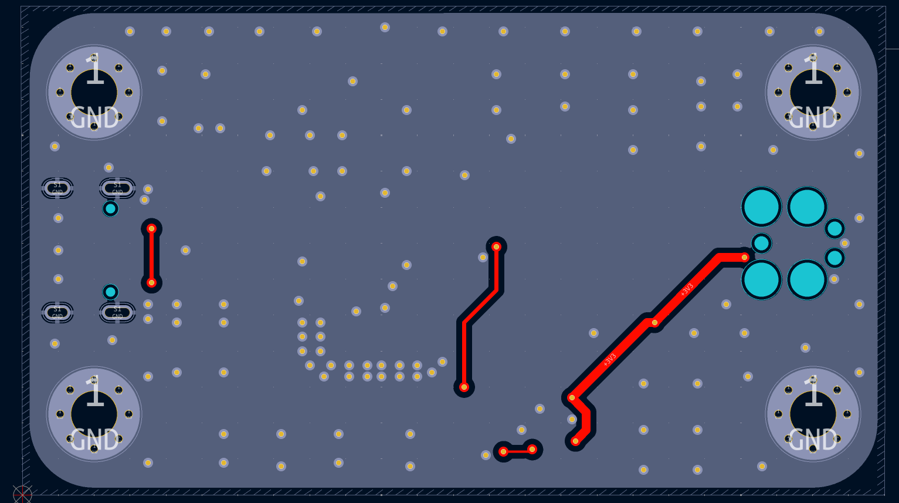
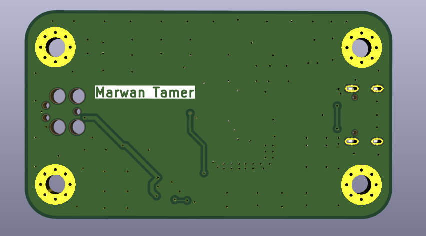

# TI MSPM0 Development Board
 
A 2-layer TI MSPM0 development board, designed in KiCad by following Phil's Lab's tutorial — this time spending less effort on replicating the steps and more on understanding the engineering decisions behind each one.
 

 
## Overview
 
This board is built around the **MSPM0G3507SPTR**, an Arm Cortex-M0+ MCU from Texas Instruments. It includes USB-C power/data via a USB-UART converter, an SWD programming header, an onboard 3.3V LDO regulator, and an onboard accelerometer — a compact general-purpose MSPM0 development platform.
 
| | |
|---|---|
| **MCU** | MSPM0G3507SPTR (Arm Cortex-M0+) |
| **Peripherals** | Onboard accelerometer (I2C) |
| **Connectivity** | USB-C, USB-to-UART bridge |
| **PCB** | 2-layer |
| **Programming** | SWD header |
| **Power** | USB-C (5V → 3.3V via onboard LDO) |
| **Design Tool** | KiCad 9 |
 
## What I Learned
 
Compared to my first PCB project, I spent less time simply following the tutorial and more time understanding the engineering decisions behind each step:
 
- Creating custom schematic symbols
- Multilayer PCB concepts and layer stack-ups
- The role of signal, power, and ground layers
- PCB manufacturing basics
- Component placement strategies
- A professional PCB layout workflow
Each project is helping me strengthen both my PCB design and embedded systems fundamentals, moving closer to making these design decisions independently.
 
## Gallery
 
| Schematic | PCB Top | PCB Bottom |
|---|---|---|
|  |  |  |
 
| 3D Front | 3D Back |
|---|---|
|  |  |
 
## Repository Structure
 
```
TI-MSPM0/
├── README.md
├── Images/              # Renders and layer screenshots
├── Hardware/            # Manufacturing-ready outputs
│   ├── TI MSPM0_Schematic.pdf
│   ├── TI MSPM0_PCB.pdf
│   ├── BOM.csv
│   └── Gerbers.zip
└── Source Files/        # Full KiCad project (editable source)
```
 
## Credit
 
Built by following [Phil's Lab](https://www.youtube.com/@PhilsLab)'s TI MSPM0 development board tutorial. This project is a learning exercise, not an original design — full credit for the schematic architecture and design decisions goes to Phil's Lab's tutorial series.
 
## Author
 
**Marwan Tamer**
Electrical Power Engineering student, building toward Embedded Systems Engineering
[LinkedIn](https://www.linkedin.com/in/-marwan-tamer)
